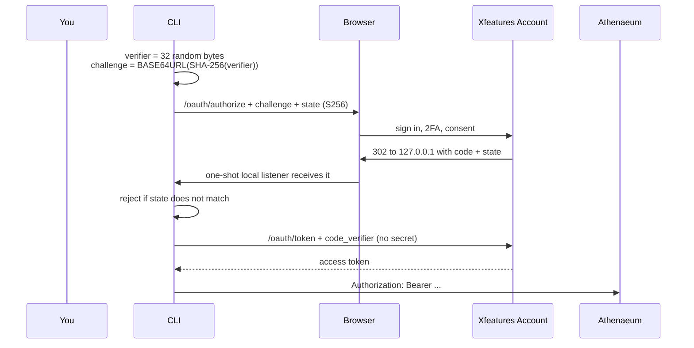

# Xfeatures Athenaeum CLI

**Search your organisation's knowledge from the terminal.**

[](https://github.com/XfeaturesGroup/XfeaturesAthenaeumCLI/actions/workflows/ci.yml)
[](#how-sign-in-works)
[](#there-is-no-client_secret-on-purpose)
[](LICENSE)

```bash
# 1. Install
git clone https://github.com/XfeaturesGroup/XfeaturesAthenaeumCLI.git
cd XfeaturesAthenaeumCLI && npm install && npm run build && npm link

# 2. Sign in — opens your browser, no secret to configure
athenaeum login

# 3. Search
athenaeum search "what is the refund window for annual plans" --domain support
```

That is the whole setup. `login` defaults to the production Athenaeum Developer
Access application, so nothing needs configuring first.

## Commands

```
athenaeum login                              Sign in with your Xfeatures Account
athenaeum logout                             Forget the stored token
athenaeum whoami                             Show token status and confirm Athenaeum accepts it
athenaeum search <query> [--domain D] [--limit N]
athenaeum get-fact <namespace> <key>
athenaeum get-document <id-or-slug> [--content]
athenaeum get-product <code>
athenaeum get-plan <code>
athenaeum get-policy <code>
athenaeum propose-document <slug> --title T --domain D --classification C --language L --file PATH
                                             [--category C] [--format markdown|text|json|html]
athenaeum submit-for-review <document-id>
```

### A worked session

```bash
$ athenaeum login
Opening your browser to sign in with Xfeatures Account...
Signed in. Token stored in ~/.config/athenaeum/credentials.json

$ athenaeum whoami
Token:        valid, expires in 58 minutes
Athenaeum:    accepted this token.

$ athenaeum search "refund window" --domain support --limit 3
[0.82] Refund Policy
       Annual plans may be refunded in full within 30 days of renewal...

$ athenaeum get-fact plans annual-pro
{ "namespace": "plans", "key": "annual-pro", "value": { "price_usd": 299 }, "version": 4 }

$ athenaeum propose-document onboarding-checklist \
    --title "Onboarding checklist" --domain support \
    --classification INTERNAL --language en --file ./checklist.md
Draft created: 01ARZ3NDEKTSV4RRFFQ69G5FAV

$ athenaeum submit-for-review 01ARZ3NDEKTSV4RRFFQ69G5FAV
Submitted for review. A human reviewer decides from HQ.
```

`propose-document` and `submit-for-review` create and submit a draft. Neither
publishes: publishing is HQ-only, by a person holding `documents.publish`.

## How sign-in works

Authorization Code with PKCE (RFC 7636), as a public native client (RFC 8252).



Signing in and being *authorized inside Athenaeum* are two different things.
This CLI does the first. Whether your Account identity reaches anything, and
with which role, is decided by Athenaeum's own database — an HQ operator links
your Account user to an Athenaeum principal from the Access page.

### There is no client_secret, on purpose

A secret shipped to every machine that installs a CLI is not a secret. This
client is registered with `token_endpoint_auth_method: "none"`, holds nothing,
and sends nothing. **PKCE is the whole of client authentication here**: a fresh
`code_verifier` per login, kept in this process's memory, transmitted exactly
once at the token exchange. Without it an intercepted authorization code is
useless.

That the flow honours this is tested rather than asserted — `src/oauth-flow.test.ts`
checks that `S256` is requested and `plain` never is, that a state mismatch
aborts the login, that the exchange carries the verifier and no `client_secret`,
and that the redirect target stays on loopback. Each check was verified to fail
against deliberately broken code.

## Configuration

Everything has a working default; override only to point at another deployment.

| Variable | Default |
|---|---|
| `ATHENAEUM_CLIENT_ID` | the production Developer Access application |
| `ATHENAEUM_ACCOUNT_WEB_URL` | `https://account.xfeatures.net` |
| `ATHENAEUM_ACCOUNT_API_URL` | `https://api.account.xfeatures.net` |
| `ATHENAEUM_BASE_URL` | `https://athenaeum.xfeatures.net` |
| `ATHENAEUM_REDIRECT_URI` | `http://localhost:8765/callback` |

A `client_id` is public by design in OAuth 2.0: it names the application, it
does not authenticate it.

## Known limitations

- **No automatic token refresh.** When the token expires, run `login` again.
  Account issues refresh tokens for this grant; the CLI simply does not use them
  yet.
- **The loopback port is fixed** at `8765` (override with
  `ATHENAEUM_REDIRECT_URI`). RFC 8252 §7.3 says a server *should* accept any
  loopback port; Account matches redirect URIs exactly, so a busy port fails
  rather than picking another.
- **`whoami` shows token state, not identity.** Athenaeum has no identity
  endpoint yet, so it reports expiry and makes one cheap call to confirm the
  token is currently accepted.

## The vendored SDK

This CLI is built on
[`@xfeatures/athenaeum-sdk`](https://github.com/XfeaturesGroup/XfeaturesAthenaeumSDK).
npm publishing is deliberately disabled and the SDK is a separate private
repository, so there is no registry to install it from — and a git dependency
would make every CI run a cross-repository credential problem.

`vendor/` therefore holds the SDK's **build output**, with the commit it came
from recorded in [`vendor/PROVENANCE.json`](vendor/PROVENANCE.json). No source
is duplicated and no authorization logic is copied: the SDK is a thin HTTP
client, and every access decision is made server-side by Athenaeum. To refresh
it against a local SDK checkout:

```bash
npm run sync:sdk            # or: npm run sync:sdk ../path/to/XfeaturesAthenaeumSDK
```

Never hand-edit anything under `vendor/`.

## Related repositories

| | |
|---|---|
| [XfeaturesAthenaeum](https://github.com/XfeaturesGroup/XfeaturesAthenaeum) | The core service: Worker, REST implementation, OpenAPI, security |
| [XfeaturesAthenaeumSDK](https://github.com/XfeaturesGroup/XfeaturesAthenaeumSDK) | The typed client this is built on |
| [XfeaturesAthenaeumMCP](https://github.com/XfeaturesGroup/XfeaturesAthenaeumMCP) | Connecting an MCP client instead |

## Licence

**Source available — proprietary software, not open source.**

Licensed under the [Xfeatures Client Software License](LICENSE) — not MIT,
Apache, GPL or any OSI-approved license. Unlike the core platform's license,
this one is written so you can actually *use* the official, unmodified client
to talk to Xfeatures Services, including commercially, as part of your own
product or internal system. What it does not permit, without written
permission: repackaging or redistributing a modified copy, reselling the
client itself, white-labelling it, or using its code to build a competing
client. Full terms in [LICENSE](LICENSE).
